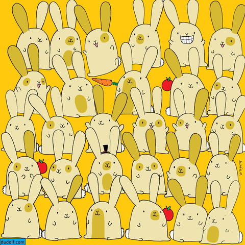

# Đếm Thỏ Trong Ảnh

Project này sử dụng một quy trình xử lý ảnh bao gồm các bước sau để tự động đếm số lượng thỏ trong ảnh:

1.  **Tiền xử lý thích nghi:** Cải thiện chất lượng ảnh và làm nổi bật màu sắc của thỏ.
2.  **Phân cụm với K-means Clustering:** Phân đoạn ảnh dựa trên màu sắc để tách vùng thỏ.
3.  **Tạo mặt nạ và xói mòn:** Tạo mặt nạ nhị phân và áp dụng phép toán xói mòn để tách các con thỏ bị dính.
4.  **Phân tích thành phần liên thông, lọc và gán nhãn màu:** Đếm số lượng thỏ dựa trên các vùng liên thông.
